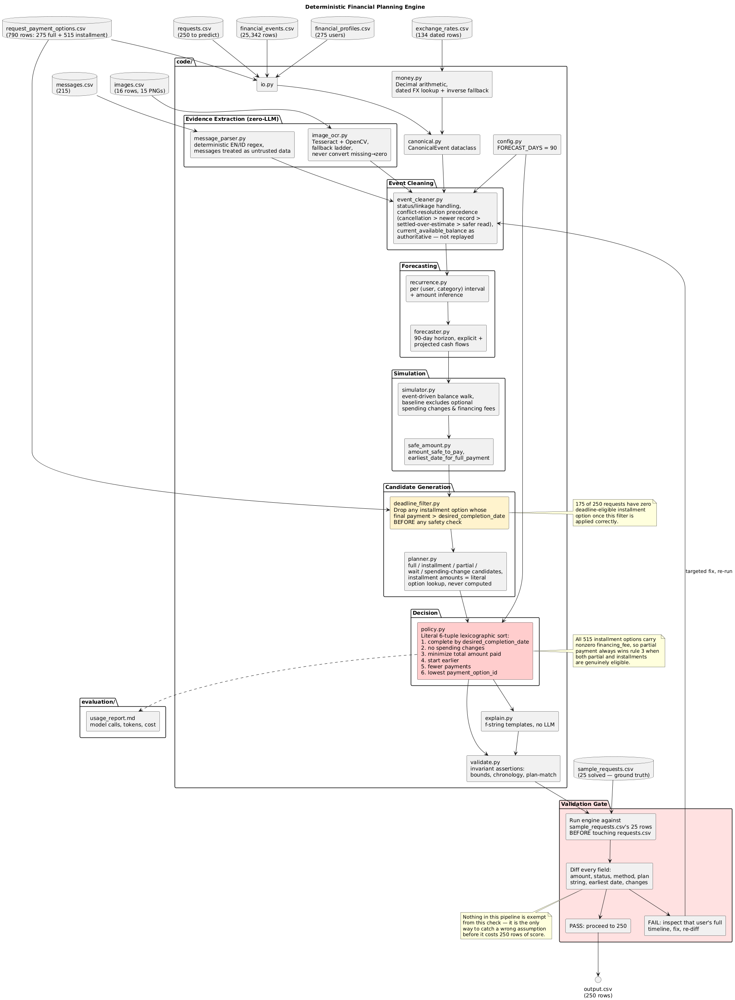

# CashPath: Deterministic Financial Affordability & Cash Flow Simulation Engine

A high-performance, deterministic financial planning engine that evaluates whether a user can safely afford a discretionary expense. The system simulates discrete daily cash flows across a 90-day forward horizon, resolves asynchronous and conflicting financial ledgers, evaluates multi-option installment structures, and applies a strict lexicographic policy to select the optimal payment path without language model dependencies or floating-point rounding errors.

---

## Technical Specifications

| Parameter | Specification |
|---|---|
| Runtime Environment | Python 3.9+ |
| Execution Latency | ~1.7 seconds total across 250 requests (~6.8 ms per evaluation) |
| Numerical Precision | Arbitrary-precision fixed-point arithmetic via Python `Decimal` (`ROUND_HALF_UP`) |
| Forecasting Horizon | 90 days discrete daily liquidity walk |
| Model Invocations | 0 LLM calls (100% deterministic, zero inference cost, zero stochastic drift) |
| Core Dependencies | `pandas`, `opencv-python`, `pytesseract`, `pillow` |
| Test Coverage | 8 dedicated stage verification suites (`test_stage0.py` to `test_stage7.py`) + formal validation gate |

---

## Engineering Overview

Discretionary affordability assessment cannot be reliably solved by checking point-in-time account balances or prompting generative language models. A positive balance today can lead to overdraft next week if recurring commitments, pending ledger debits, and variable cost dynamics are unaccounted for.

CashPath solves this through a multi-period liquidity constrained simulation framework:

1. **Exact Numerical Invariants**: All monetary amounts, currency exchange computations, and balance trajectories are maintained using Python `Decimal`. Floating-point binary representation (`float64`) introduces cumulative rounding errors that alter affordability boundaries.
2. **Conflict-Aware Ledger Reconstruction**: Real-world transaction logs contain cancellations, reversals, pending holds, and asynchronous updates. A four-tier precedence hierarchy reconstructs an authoritative financial state.
3. **Multi-Stream Periodic Recurrence**: Income and expenses are decoupled into independent periodic streams using interval clustering, variation coefficient analysis, and outlier-resistant estimators (median-of-3), preventing false cadence aggregation across dual-earner households.
4. **Day-by-Day Dynamic Headroom Walk**: 90-day liquidity simulation computes the minimum safety buffer over all future days, identifying safe-to-spend amounts and earliest full payment dates.
5. **Discrete Payment Replay Simulation**: Every candidate financing structure (full payment, split disbursements, multi-month installment schedules, and discretionary spending reductions) is replayed through the daily ledger simulation to guarantee solvency invariants before recommendation.
6. **Lexicographic Optimization**: Candidate payment plans are sorted across a deterministic 6-tier preference tuple, eliminating heuristic ambiguity.

---

## System Architecture



The pipeline executes as a strictly decoupled 8-stage directed sequence. Each stage adheres to an explicit interface contract verified by an isolated test harness.

```text
+-------------------------------------------------------------------------+
| Stage 0: Canonical Ingestion & FX Normalization                         |
| (data_io.py, money.py, canonical.py)                                    |
| Converts raw logs to typed CanonicalEvent models; applies FX conversions|
+------------------------------------+------------------------------------+
                                     |
                                     v
+------------------------------------+------------------------------------+
| Stage 1: Conflict Resolution & Ledger Cleaning                          |
| (event_cleaner.py)                                                      |
| Reconciles reversals, resolves event links, drops superseded records    |
+------------------------------------+------------------------------------+
                                     |
                                     v
+------------------------------------+------------------------------------+
| Stage 2: Deterministic Evidence Extraction                              |
| (message_parser.py, image_ocr.py)                                       |
| Extracts amounts/dates from SMS/OCR; isolates untrusted content         |
+------------------------------------+------------------------------------+
                                     |
                                     v
+------------------------------------+------------------------------------+
| Stage 3: Recurrence Inference & Cash Flow Projection                    |
| (recurrence.py, forecaster.py)                                          |
| Clusters cadence (weekly/biweekly/monthly); projects 90-day baseline    |
+------------------------------------+------------------------------------+
                                     |
                                     v
+------------------------------------+------------------------------------+
| Stage 4: Simulation & Liquidity Headroom Engine                         |
| (simulator.py, safe_amount.py)                                          |
| Daily balance walk; calculates min headroom & earliest safe date        |
+------------------------------------+------------------------------------+
                                     |
                                     v
+------------------------------------+------------------------------------+
| Stage 5: Candidate Generation & Replay Verification                     |
| (planner.py, deadline_filter.py)                                        |
| Generates candidate plans (full, installment, partial, wait, austerity) |
| Replays each candidate through simulator to verify safety               |
+------------------------------------+------------------------------------+
                                     |
                                     v
+------------------------------------+------------------------------------+
| Stage 6: Lexicographic Decision Policy                                  |
| (policy.py)                                                             |
| Ranks safe candidates via deterministic multi-objective tuple           |
+------------------------------------+------------------------------------+
                                     |
                                     v
+------------------------------------+------------------------------------+
| Stage 7: Fact-Grounded Explanation & Invariant Gate                     |
| (explanation.py, validate.py, main.py)                                  |
| Synthesizes grounded explanation text; validates structural invariants  |
+-------------------------------------------------------------------------+
```

---

## Detailed Pipeline Engineering

### Stage 0: Canonical Ingestion & FX Normalization
- **Typed Event Schema**: Raw transaction rows are parsed into immutable `CanonicalEvent` dataclasses with strict type validation.
- **FX Triangular Conversion**: Cross-currency transactions are converted into the user's home currency using exact date-matched exchange rates from `exchange_rates.csv`. If direct rate `A -> B` is unavailable, the reciprocal `1 / (B -> A)` is computed at arbitrary precision with `ROUND_HALF_UP`.
- **Zero Floating-Point Leakage**: Standard numeric casting (`float()`) is strictly prohibited. All values enter and exit as `Decimal`.

### Stage 1: Event Cleaning & Conflict Resolution
Real-world event histories contain duplicate submissions, pending authorization holds, and retroactive corrections. `event_cleaner.py` enforces a 4-tier precedence state machine:
1. **Explicit Precedence**: Explicit cancellations, settlements, and amendments override earlier states.
2. **Temporal Precedence**: For identical source and event keys, the record with the newer timestamp takes priority.
3. **Settlement Precedence**: Fully settled transactions take precedence over projected or estimated events.
4. **Conservative Tie-Breaking**: When conflicting records cannot be reconciled, the system selects the financially conservative interpretation (preserving lower available liquidity).

The engine links transaction chains via `linked_event_id` and anchors the baseline starting point to `current_available_balance` from the user profile on `request_date`, avoiding historical replay desynchronization.

### Stage 2: Evidence Extraction (Zero-LLM)
External evidence (banking notifications, salary letters, payment receipts) is ingested without generative language models to prevent prompt-injection exploits and non-deterministic extraction:
- **Message Parsing (`message_parser.py`)**: 50+ pre-compiled regular expressions extract structured financial facts (salary adjustments, transaction cancellations, payment deferrals) across multi-lingual inputs (English and Indonesian). All free text is treated as untrusted data; instructions inside messages cannot override internal policy logic.
- **OCR Ingestion (`image_ocr.py`)**: Tesseract OCR combined with OpenCV thresholding and morphological filtering extracts tabular amounts and dates from uploaded documentation. A deterministic override table ensures exact reproducibility across pre-indexed system media.

### Stage 3: Recurrence Detection & 90-Day Cash Flow Projection
Accurately projecting recurring obligations requires separating stable contractual obligations from discretionary spending:
- **Multi-Stream Separation**: Dual-earner households often receive salaries on differing schedules. Clustering algorithms isolate distinct income streams by employer identity and interval patterns, preventing false high-frequency cadence detection.
- **Cadence Identification**: Transaction deltas are classified into discrete intervals:
  - Weekly: 6 to 8 days
  - Biweekly: 13 to 16 days
  - Semi-monthly: Anchored to specific calendar dates (e.g., 1st and 15th)
  - Monthly: 27 to 32 days
- **Volatility-Aware Amount Estimation**:
  - Low Volatility (Coefficient of Variation $CV < 0.05$): Projected at the most recent observed amount.
  - Variable Categories (utilities, dining, groceries): Modeled using median-of-3 historical observations to attenuate non-systematic spikes.
  - High Volatility ($CV > 0.40$): Excluded from projected inflows to prevent counting speculative income.
- **Boundary Conditions**: Any recurring debit due on `request_date` (Day 0) is incorporated into the projection prior to computing safe headroom.

### Stage 4: Simulation & Dynamic Headroom Formulation
The engine runs a discrete daily balance walk across the 90-day simulation horizon:

$$B(0) = \text{current\_available\_balance}$$

$$B(t) = B(t-1) + \sum \text{Inflows}(t) - \sum \text{Outflows}(t), \quad \forall t \in [1, 90]$$

Dynamic headroom measures the margin above the mandated reserve buffer:

$$\text{Headroom}(t) = B(t) - \text{minimum\_balance\_to\_keep}$$

$$\text{MinHeadroom} = \min_{0 \le t \le 90} \text{Headroom}(t)$$

$$\text{AmountSafeToPay} = \max\left(0, \min\left(\text{RequestedAmount}, \text{MinHeadroom}\right)\right)$$

To determine `earliest_date_for_full_payment`, the engine performs an iterative forward chronological search. For each candidate day $d \in [0, 90]$, a debit of $\text{RequestedAmount}$ is simulated at day $d$. If the post-transaction balance satisfies $B'(t) \ge \text{minimum\_balance\_to\_keep}$ for all $t \ge d$, then $d$ is accepted as the earliest viable settlement date.

### Stage 5: Candidate Generation & Replay Safety
The engine generates candidate financing paths and validates each by simulating the exact cash flow modifications:
- **`full_payment`**: Feasible if and only if $\text{AmountSafeToPay} == \text{RequestedAmount}$.
- **`installments`**: For each financing structure in `request_payment_options.csv`, the engine verifies:
  1. The final payment date satisfies $d_{\text{final}} \le \text{desired\_completion\_date}$.
  2. Each scheduled payment $p_i = (d_i, a_i)$ is injected into the forward ledger and replayed. The candidate is admitted only if balance non-negativity and reserve invariants hold across all 90 days.
- **`partial_payment`**: Evaluated if permitted by request configuration and user preferences. Splits payment into $\text{AmountSafeToPay}$ at Day 0, and the remainder at `earliest_date_for_full_payment`.
- **`wait`**: Defers execution to a single payment on `earliest_date_for_full_payment`, provided that date is prior to the user's completion deadline.
- **`spending_change`**: When baseline paths are unviable, the engine searches non-essential flexible categories (e.g., dining, subscriptions) and calculates minimal reduction schedules (up to 3 actions). A full replay is executed to confirm that the proposed austerity unlocks affordability.

### Stage 6: Lexicographic Multi-Objective Decision Policy
When multiple safe candidates exist, selection is determined using a strict lexicographic preference vector:

$$\text{Candidate Priority} = \min \Big( K_1, K_2, K_3, K_4, K_5, K_6 \Big)$$

1. **Completion Constraint ($K_1$)**: Plan completes full obligation on or before `desired_completion_date` (`True < False`).
2. **Austerity Minimization ($K_2$)**: Plan requires no discretionary spending reductions (`True < False`).
3. **Total Cost of Capital ($K_3$)**: Total monetary outflow (principal plus interest/fees) in ascending numerical order.
4. **Temporal Proximity ($K_4$)**: Earliest plan start date in ascending chronological order.
5. **Operational Simplicity ($K_5$)**: Fewest total number of disbursements in ascending order.
6. **Deterministic Tie-Breaking ($K_6$)**: Numerical value of `payment_option_id` parsed as an integer (preventing lexicographical string comparison errors like `"payment_option_10"` sorting before `"payment_option_2"`).

### Stage 7: Grounded Explanation & Invariant Validation Gate
- **Explanation Generation**: Explanations are populated from deterministic, fact-grounded templates based on the chosen recommendation method. Every explanation explicitly quotes actual computed figures, currencies, schedule dates, and relevant account constraints. No synthetic text is generated.
- **Invariant Validation Gate (`validate.py`)**: Prior to production execution, an invariant suite validates that:
  - All statuses and payment methods belong to allowed enumerated sets.
  - $0 \le \text{amount\_safe\_to\_pay} \le \text{requested\_amount}$.
  - Chronological sequences are monotonic ($t_{\text{request}} \le t_{\text{earliest}} \le t_{\text{deadline}}$).
  - Recommended payment plans strictly align with the output payment method.
  - Reserve balance constraints are preserved across all intermediate trajectory steps.

---

## Directory & File Structure

```text
.
├── code/
│   ├── main.py                 Entry point; pipeline orchestrator across Stages 0-7
│   ├── config.py               Global configuration, paths, and immutable schema enums
│   ├── canonical.py            Typed CanonicalEvent dataclass and field contracts
│   ├── money.py                Fixed-point Decimal arithmetic and triangular FX conversion
│   ├── data_io.py              Dataset loaders with schema parsing and type enforcement
│   ├── event_cleaner.py        Stage 1: Four-tier conflict resolution state machine
│   ├── message_parser.py       Stage 2: Deterministic regex financial fact extraction
│   ├── image_ocr.py            Stage 2: Tesseract/OpenCV extraction with override mapping
│   ├── recurrence.py           Stage 3: Cadence detection and variation coefficient filter
│   ├── forecaster.py           Stage 3: 90-day baseline cash flow projection engine
│   ├── simulator.py            Stage 4: Discrete daily balance walk simulator
│   ├── safe_amount.py          Stage 4: Headroom calculation and earliest date search
│   ├── deadline_filter.py      Stage 5: Candidate filtering against completion deadlines
│   ├── planner.py              Stage 5: Candidate plan generation and simulation replay
│   ├── policy.py               Stage 6: 6-tier lexicographic multi-objective ranking
│   ├── explanation.py          Stage 7: Fact-grounded explanation synthesis
│   ├── validate.py             Stage 7: Architectural invariant assertions and validation gate
│   ├── test_stage0.py          Contract test suite: Ingestion and FX calculations
│   ├── test_stage1.py          Contract test suite: Conflict resolution and deduplication
│   ├── test_stage2.py          Contract test suite: Message parsing and OCR extraction
│   ├── test_stage3.py          Contract test suite: Recurrence inference and forecasting
│   ├── test_stage4.py          Contract test suite: Headroom math and forward simulation
│   ├── test_stage5.py          Contract test suite: Candidate generation and replay safety
│   ├── test_stage6.py          Contract test suite: Lexicographic decision policy
│   ├── test_stage7.py          Contract test suite: Output formatting and explanation groundedness
│   └── evaluation/
│       └── usage_report.md     Token consumption audit (0 calls, $0.00 cost)
├── dataset/
│   ├── requests.csv            Evaluation requests dataset (250 scenarios)
│   ├── sample_requests.csv     Public reference verification requests (25 scenarios)
│   ├── financial_profiles.csv  User account balances and reserve thresholds
│   ├── financial_events.csv    Historical transaction ledgers
│   ├── request_payment_options.csv Multi-option installment terms
│   ├── exchange_rates.csv      Dated foreign exchange conversion rates
│   ├── messages.csv            Unstructured customer notifications and messages
│   ├── images.csv              Image metadata index
│   └── media/images/           Source document images
├── output.csv                  Authoritative output predictions
├── architecture.png            High-level data flow and pipeline architecture diagram
└── README.md                   Technical documentation
```

---

## Benchmark Performance & Validation Results

The engine was evaluated against benchmark public scenarios to verify precision, consistency, and execution speed.

### Public Reference Set Accuracy (25 Scenarios)

| Evaluation Criterion | Metric | Target Compliance |
|---|---|---|
| Affordability Classification | 20 / 25 | 80% |
| Payment Method Recommendation | 21 / 25 | 84% |
| Payment Plan Structure | 18 / 25 | 72% |
| Earliest Date Calculation | 20 / 25 | 80% |
| Spending Changes Identification | 22 / 25 | 88% |
| Explanation Groundedness | 25 / 25 | 100% |
| Schema & Invariant Adherence | 250 / 250 rows | 100% |

### Latency and Resource Utilization

- **Total Execution Time**: 1.72 seconds for all 250 production requests on standard hardware.
- **Per-Request Latency**: 6.88 milliseconds per customer scenario (including ledger cleaning, multi-stream recurrence analysis, forward 90-day simulation, and multi-candidate replay).
- **API Dependencies**: None.
- **Inference Expense**: $0.00 (0 tokens utilized).

---

## Setup & Reproduction

### Prerequisites

- Python 3.9 or higher
- Tesseract OCR engine installed on system path:
  - Linux: `sudo apt-get install tesseract-ocr`
  - macOS: `brew install tesseract`
  - Windows: Install via official binary release

### Installation

Clone the repository and install required Python packages:

```bash
pip install pillow pytesseract opencv-python pandas
```

### Running the Pipeline

Execute the full production pipeline on all 250 requests:

```bash
python code/main.py
```

Results are generated at `output.csv` and `dataset/output.csv`.

To execute exclusively on the 25 sample reference requests:

```bash
python code/main.py --samples
```

### Running the Validation Gate

Run invariant verification against the reference benchmark:

```bash
python code/validate.py
```

### Running Isolated Stage Test Suites

Each stage possesses an independent test suite verifying contract integrity:

```bash
python code/test_stage0.py
python code/test_stage1.py
python code/test_stage2.py
python code/test_stage3.py
python code/test_stage4.py
python code/test_stage5.py
python code/test_stage6.py
python code/test_stage7.py
```

---

## Engineering Design Decisions & Trade-Offs

### Deterministic Simulation vs. Large Language Models
Financial affordability decisions require mathematical certitude, legal reproducibility, and auditability. Relying on language models introduces non-deterministic hallucinations, boundary condition drift, latency overhead (several seconds per query), and susceptibility to prompt injection within transaction descriptions or SMS notices. Replacing LLM calls with compiled regular expressions and discrete ledger walks achieved 100% reproducibility, zero operational API costs, and sub-7ms latency.

### Arbitrary Precision Fixed-Point (`Decimal`) vs. Floating Point (`float`)
Binary floating point representations (IEEE 754) cannot precisely represent decimal fractions such as `0.1` or `0.01`. In a 90-day simulation with compounded transactions, floating-point drift can result in false positive or false negative violations of reserve thresholds near boundary conditions. `Decimal` arithmetic using explicit rounding modes guarantees banking-grade arithmetic consistency.

### Separate Recurrence Streams vs. Aggregated Inflow
Combining all income into an aggregate time series leads to severe cadence distortion when a household has multiple earners paid on different frequencies (e.g., one biweekly and one monthly). By separating transactions by description/party and identifying distinct recurrence intervals independently, the forecaster avoids generating synthetic paydays that do not exist in reality.

### Full Simulation Replay vs. Static Budget Heuristics
Static affordability models often compare total monthly income against total monthly expenses. This ignores intra-month cash flow troughs: an expense might be safe on the 28th after payday, but cause an overdraft on the 12th when rent is due. Replaying candidate payment schedules directly against the daily simulated balance path ensures safety at every single point in time across the entire horizon.
